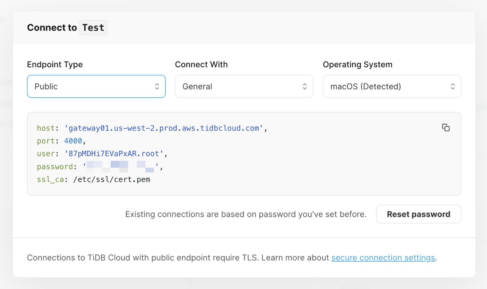

# Connecting to TiDB with mysqljs/mysql driver

[](https://nodejs.org/en)
[](https://github.com/mysqljs/mysql)

TiDB is a MySQL-compatible database, and mysqljs/mysql is a pure node.js JavaScript Client implementing the MySQL protocol for the database connection and SQL operations.

The following guide will show you how to connect to the TiDB cluster with Node.js [mysqljs/mysql](https://github.com/mysqljs/mysql) driver and perform basic SQL operations like create, read, update, and delete.

> **Note**
> 
> To connect to a TiDB Serverless cluster with public endpoint, you **MUST** [enable TLS connection on the node-mysql driver](#connect-with-connection-options).

## Prerequisites

To complete this guide, you need:

- [Node.js](https://nodejs.org/en) >= 16.x installed on your machine
- [Git](https://git-scm.com/downloads) installed on your machine
- A TiDB cluster running

**If you don't have a TiDB cluster yet, please create one with one of the following methods:**

1. (**Recommend**) [Start up a TiDB Serverless cluster](https://tidbcloud.com/free-trial?utm_source=github&utm_medium=quickstart) instantly with a few clicks on TiDB Cloud.
2. [Start up a TiDB Playground cluster](https://docs.pingcap.com/tidb/stable/quick-start-with-tidb#deploy-a-local-test-cluster) with TiUP CLI on your local machine.

## Getting started

This section demonstrates how to run the sample application code and connect to TiDB with Node.js [mysqljs/mysql](https://github.com/mysqljs/mysql) driver.

### 1. Clone the repository

Run the following command to clone the sample code locally：

```shell
git clone https://github.com/tidb-samples/tidb-nodejs-mysqljs-quickstart.git
cd tidb-nodejs-mysqljs-quickstart
```

### 2. Install dependencies

Run the following command to install the dependencies (including the `mysql` package) required by the sample code：

```shell
npm install
```

<details>
<summary><b>Install dependencies to existing project</b></summary>

For your existing project, run the following command to install the packages:

- `mysql`: A pure node.js JavaScript Client implementing the MySQL protocol for the database connection and SQL operations.
- `dotenv`: The utils package to loading environment variables from the `.env` file.

```shell
npm install mysql dotenv --save
```
</details>

### Step 3. Provide connection parameters

<details open>
<summary><b>(Option 1) TiDB Serverless</b></summary>

1. Navigate to the [Clusters](https://tidbcloud.com/console/clusters) page, and then click the name of your target cluster to go to its overview page.
2. Click **Connect** in the upper-right corner.
3. In the connection dialog, select `General` from the **Connect With** dropdown and keep the default setting of the **Endpoint Type** as `Public`.
4. If you have not set a password yet, click **Create password** to generate a random password.

    <div align="center">
        <picture>
            <source media="(prefers-color-scheme: dark)" srcset="./static/images/tidb-cloud-connect-dialog-dark-theme.png" width="600">
            
        </picture>
        <div><i>The connection dialog of TiDB Serverless</i></div>
    </div>

5. Make a copy of the `.env.example` file to the `.env` file:

   ```shell
   cp .env.example .env
   ```

6. Edit the `.env` file, copy the connection parameters on the connection dialog, and replace the corresponding placeholders `{}`. The example configuration is as follows:

    ```dotenv
    TIDB_HOST={host}
    TIDB_PORT=4000
    TIDB_USER={user}
    TIDB_PASSWORD={password}
    TIDB_DATABASE=test
    TIDB_ENABLE_SSL=true
    ```

   > Modify `TIDB_ENABLE_SSL` to `true` to enable a TLS connection. (Required for public endpoint)

</details>

<details>
<summary><b>(Option 2) TiDB Dedicated</b></summary>

You can obtain the database connection parameters on [TiDB Cloud's Web Console](https://tidbcloud.com/console) through the following steps:

1. Navigate to the [Clusters](https://tidbcloud.com/console/clusters) page, and then click the name of your target cluster to go to its overview page.
2. Click **Connect** in the upper-right corner. A connection dialog is displayed.
3. Click **Allow Access from Anywhere**, and then click **Download TiDB cluster CA** to download the CA certificate.
4. Select `General` from the **Connect With** dropdown and select `Public` from the **Endpoint Type** dropdown.
5. Run the following command to copy `.env.example` and rename it to `.env`:

    ```shell
    cp .env.example .env
    ```

6. Edit the `.env` file, copy the connection parameters on the connection dialog, and replace the corresponding placeholders `{}`. The example configuration is as follows:

    ```dotenv
    TIDB_HOST=<host>
    TIDB_PORT=4000
    TIDB_USER=<user>
    TIDB_PASSWORD=<password>
    TIDB_DATABASE=test
    TIDB_ENABLE_SSL=true
    TIDB_CA_PATH=/path/to/ca.pem
    ```

   > Modify `TIDB_ENABLE_SSL` to `true` to enable a TLS connection and using `TIDB_CA_PATH` to specify the file path of CA certificate downloaded from the connection dialog.

</details>

<details>
<summary><b>(Option 3) TiDB Self-Hosted</b></summary>

1. Make a copy of the `.env.example` file to the `.env` file.

   ```shell
   cp .env.example .env
   ```

2. Replace the placeholders for `<host>`, `<user>`, and `<password>` with the connection parameters of your TiDB cluster.

    ```dotenv
    TIDB_HOST=<host>
    TIDB_PORT=4000
    TIDB_USER=<user>
    TIDB_PASSWORD=<password>
    TIDB_DATABASE=test
    # TIDB_ENABLE_SSL=true
    # TIDB_CA_PATH=/path/to/ca.pem
    ```

   The TiDB Self-Hosted cluster using non-encrypted connection between TiDB's server and clients by default.

   If you want to enable TLS connection, please uncomment the `TIDB_ENABLE_SSL` and `TIDB_CA_PATH` options and specify the file path of CA certificate defined with [`ssl-ca`](https://docs.pingcap.com/tidb/stable/tidb-configuration-file#ssl-ca) option.

</details>

### Step 4. Run the sample code

Run the following command to execute the sample code:

```shell
npm start
```

**Expected execution output:**

If the connection is successful, the console will output the version of the TiDB cluster.

```
🔌 Connected to TiDB cluster! (TiDB version: 5.7.25-TiDB-v7.1.0)
⏳ Loading sample game data...
✅ Loaded sample game data.

🆕 Created a new player with ID 12.
ℹ️ Got Player 12: Player { id: 12, coins: 100, goods: 100 }
🔢 Added 50 coins and 50 goods to player 12, updated 1 row.
🚮 Deleted 1 player data.
```

## Sample code snippets

### Connect with connection options

The following code establish a connection to TiDB with options defined in environment variables:

```javascript
// Step 1. Import the 'mysql' and 'dotenv' packages.
import { createConnection } from "mysql";
import dotenv from "dotenv";
import * as fs from "fs";

// Step 2. Load environment variables from .env file to process.env.
dotenv.config();

// Step 3. Create a connection with the TiDB cluster.
const options = {
    host: process.env.TIDB_HOST || '127.0.0.1',
    port: process.env.TIDB_PORT || 4000,
    user: process.env.TIDB_USER || 'root',
    password: process.env.TIDB_PASSWORD || '',
    database: process.env.TIDB_DATABASE || 'test',
    ssl: process.env.TIDB_ENABLE_SSL === 'true' ? {
        minVersion: 'TLSv1.2',
        ca: process.env.TIDB_CA_PATH ? fs.readFileSync(process.env.TIDB_CA_PATH) : undefined
    } : null,
}
const conn = createConnection(options);

// Step 4. Perform some SQL operations...

// Step 5. Close the connection.
conn.end();
```

> For TiDB Serverless, TLS connection **MUST** be enabled via `TIDB_ENABLE_SSL` when using public endpoint, but you **don't** have to specify an SSL CA certificate via `TIDB_CA_PATH`, because Node.js uses the built-in [Mozilla CA certificate](https://wiki.mozilla.org/CA/Included_Certificates) by default, which is trusted by TiDB Serverless.
### Insert data

The following query creates a single `Player` record and returns a `ResultSetHeader` object:

```javascript
conn.query('INSERT INTO players (coins, goods) VALUES (?, ?);', [coins, goods], (err, ok) => {
   if (err) {
       console.error(err);
   } else {
       console.log(ok.insertId);
   }
});
```


For more information, refer to [Insert data](https://docs.pingcap.com/tidbcloud/dev-guide-insert-data).

### Query data

The following query returns a single `Player` record by ID `1`:

```javascript
conn.query('SELECT id, coins, goods FROM players WHERE id = ?;', [id], (err, rows) => {
    if (err) {
        console.error(err);
    } else {
        console.log(rows[0]);
    }
});
```

For more information, refer to [Query data](https://docs.pingcap.com/tidbcloud/dev-guide-get-data-from-single-table).

### Update data

The following query adds `50` coins and `50` goods to the `Player` with ID `1`:

```javascript
conn.query(
   'UPDATE players SET coins = coins + ?, goods = goods + ? WHERE id = ?;',
   [incCoins, incGoods, playerID],
   (err, ok) => {
      if (err) {
         console.error(err);
      } else {
          console.log(ok.affectedRows);
      }
   }
);
```

For more information, refer to [Update data](https://docs.pingcap.com/tidbcloud/dev-guide-update-data).

### Delete data

The following query deletes the `Player` record with ID `1`:

```javascript
async function deletePlayerByID(conn, id) {
    return new Promise((resolve, reject) => {
        conn.query('DELETE FROM players WHERE id = ?;', [id], (err, ok) => {
            if (err) {
                reject(err);
            } else {
                resolve(ok.affectedRows);
            }
        });
    });
}
```

For more information, refer to [Delete data](https://docs.pingcap.com/tidbcloud/dev-guide-delete-data).

## Best practices

- Using [connection pools](https://github.com/mysqljs/mysql#pooling-connections) to manage database connections, which can reduce the performance overhead caused by frequently establishing/destroying connections.
- [Escaping query values](https://github.com/mysqljs/mysql#escaping-query-values) before executing SQL statements to prevent SQL injection attacks.

    > **Notice:** The `mysqljs/mysql` package does not yet support prepared statements, it only escapes values on the client side (related issue: [mysqljs/mysql#274](https://github.com/mysqljs/mysql/issues/274)). If you want to use this feature to avoid SQL injection or improve efficiency of batch insert/update, it is recommended to use [mysql2](https://github.com/sidorares/node-mysql2) package instead.

- Using ORM frameworks to improve development efficiency in scenarios without a number of complex SQL statements, such as: [Sequelize](https://sequelize.org/), [TypeORM](https://typeorm.io/), and [Prisma](https://prisma.io/docs).
- Enable the `supportBigNumbers: true` option when dealing with big numbers (`BIGINT` and `DECIMAL` columns) in the database.

## What's next

- Check out the documentation of [mysqljs/mysql](https://github.com/mysqljs/mysql#readme) for more usage about the driver.
- Explore the real-time analytics feature on the [TiDB Cloud Playground](https://play.tidbcloud.com/real-time-analytics).
- Read the [TiDB Developer Guide](https://docs.pingcap.com/tidbcloud/dev-guide-overview) to learn more details about application development with TiDB.
  - [HTAP Queries](https://docs.pingcap.com/tidbcloud/dev-guide-hybrid-oltp-and-olap-queries)
  - [Transaction](https://docs.pingcap.com/tidbcloud/dev-guide-transaction-overview)
  - [Optimizing SQL Performance](https://docs.pingcap.com/tidbcloud/dev-guide-optimize-sql-overview)
